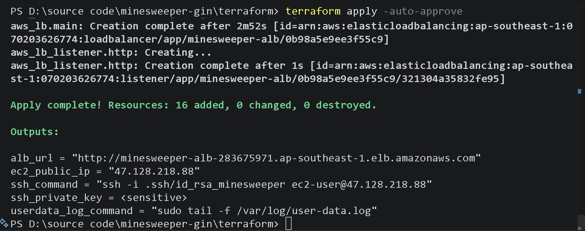
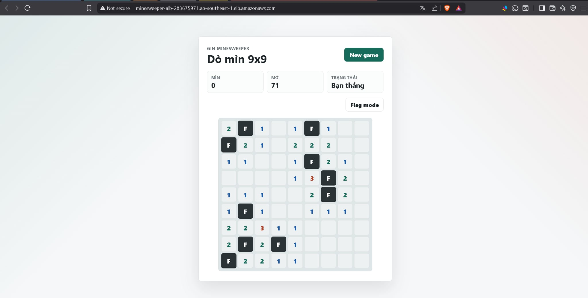
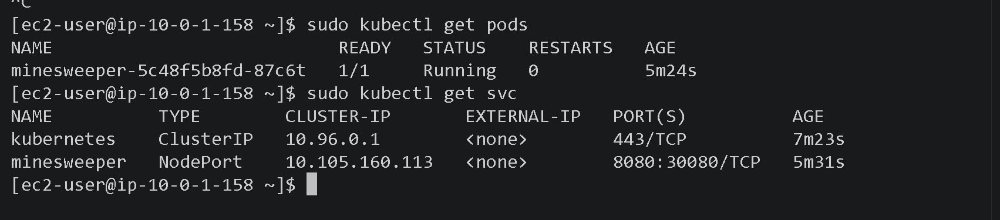
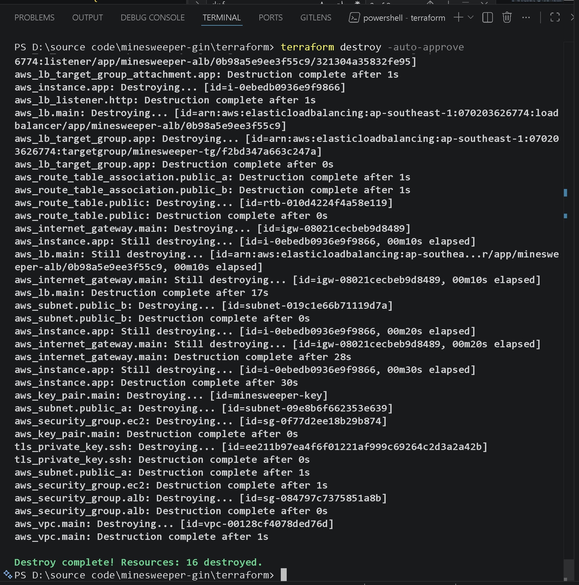

# Minesweeper Gin — K8s on AWS (Terraform 1-Click)

> Deploy game **Minesweeper** (Go + Gin) lên **Kubernetes** (minikube) trên EC2, expose ra Internet qua **AWS ALB** — chỉ cần **1 lệnh duy nhất** `terraform apply`.

---

## Kiến trúc tổng quan

```
                         ┌─────────────────────────────────────────┐
Internet ──── :80 ──────▶│   AWS Application Load Balancer (ALB)   │
                         │   (internet-facing, 2 AZs)              │
                         └──────────────┬──────────────────────────┘
                                        │ HTTP :30080 (Target Group)
                                        ▼
                         ┌─────────────────────────────────────────┐
                         │  EC2  t3.medium  (Amazon Linux 2023)    │
                         │  ┌───────────────────────────────────┐  │
                         │  │  minikube cluster (docker driver)  │  │
                         │  │  ┌─────────────────────────────┐  │  │
                         │  │  │  Pod: minesweeper-gin       │  │  │
                         │  │  │  image: minesweeper-gin:local│  │  │
                         │  │  │  containerPort: 8080        │  │  │
                         │  │  └─────────────────────────────┘  │  │
                         │  │  Service: NodePort 30080 → 8080   │  │
                         │  └───────────────────────────────────┘  │
                         │  Docker  │  Security Group              │
                         └─────────────────────────────────────────┘
```

### Luồng request

```
User browser
  → ALB :80 (internet-facing)
  → Target Group → EC2 :30080 (NodePort)
  → minikube docker container :30080 (--ports mapping)
  → K8s Service ClusterIP :8080
  → Pod minesweeper-gin :8080
```

---

## Wire Provider (≥2 providers — bắt buộc)

Project sử dụng **2 Terraform providers** được wire với nhau:

| Provider | Version | Mục đích |
|---|---|---|
| **`hashicorp/aws`** | ~> 5.0 | EC2, VPC, Subnets, IGW, SG, ALB, Target Group, Key Pair |
| **`hashicorp/tls`** | ~> 4.0 | Tự động sinh RSA-4096 SSH key pair (không cần tạo tay) |

### Sơ đồ wire giữa 2 providers

```
┌──────────────────────────┐         ┌──────────────────────────┐
│     TLS Provider         │         │      AWS Provider        │
│                          │         │                          │
│  tls_private_key.ssh     │         │  aws_key_pair.main       │
│    ├─ algorithm: RSA     │  wire   │    ├─ key_name           │
│    ├─ rsa_bits: 4096     │────────▶│    └─ public_key ◄───────│
│    │                     │         │          │               │
│    ├─ public_key_openssh─┤─────────┤──────────┘               │
│    └─ private_key_pem    │         │                          │
│         │                │         │  aws_instance.app        │
│         │ (sensitive)    │         │    └─ key_name ◄─────────│
│         ▼                │         │          │               │
│    terraform output      │         │          │               │
│    (SSH vào EC2 debug)   │         │  aws_key_pair.main       │
│                          │         │    .key_name─────────────┤
└──────────────────────────┘         └──────────────────────────┘
```

### Giải thích cách wire

1. **TLS provider** (`tls_private_key.ssh`) sinh một cặp RSA-4096 key pair hoàn toàn trong Terraform state
2. **Output** `public_key_openssh` (từ TLS provider) được truyền trực tiếp vào **input** `public_key` của `aws_key_pair.main` (AWS provider)
3. `aws_key_pair.main.key_name` được wire tiếp vào `aws_instance.app.key_name` để EC2 nhận SSH key
4. `private_key_pem` (sensitive) được expose qua `terraform output` để user SSH debug

**Tại sao chọn TLS provider?**
- Không cần tạo SSH key tay (thao tác `ssh-keygen` + import)
- Toàn bộ lifecycle key pair được quản lý bởi Terraform
- `terraform destroy` sẽ tự dọn sạch cả key
- Đây là cross-provider dependency pattern điển hình trong Terraform

---

## Cấu trúc thư mục

```
minesweeper-gin/
├── Makefile                # Quản lý các lệnh rút gọn (Go + Terraform)
├── main.go                 # Entry point — Gin server, load templates, routes
├── go.mod / go.sum         # Go module dependencies
├── Dockerfile              # Multi-stage build: golang:1.25 → alpine:3.19
├── controllers/            # Game logic handlers
├── models/                 # Data models (Board, Cell)
├── views/                  # HTML templates (Go template)
├── static/                 # CSS + JS (frontend game logic)
├── k8s/
│   ├── deployment.yaml     # K8s Deployment (imagePullPolicy: Never)
│   └── service.yaml        # K8s Service NodePort :30080 → :8080
├── terraform/
│   ├── main.tf             # Provider config (aws + tls)
│   ├── variables.tf        # Biến: region, instance_type, app_name, github_repo
│   ├── vpc.tf              # VPC, 2 public subnets (2 AZs), IGW, route table
│   ├── security_group.tf   # SG cho ALB (:80 in) và EC2 (:30080 from ALB, :22 SSH)
│   ├── ec2.tf              # TLS key → AWS key pair → EC2 + user_data (minikube)
│   ├── alb.tf              # ALB, Target Group (:30080), HTTP Listener (:80)
│   └── outputs.tf          # ALB URL, EC2 IP, SSH command, private key
├── evidence/                   # Ảnh bằng chứng
│   ├── 01-terraform-apply.jpg
│   ├── 02-app-browser.jpg
│   ├── 03-kubectl-pods-svc.jpg
│   └── 04-terraform-destroy.jpg
├── .gitignore
└── README.md               # ← Bạn đang đọc file này
```

---

## Prerequisites

Cần cài sẵn trên máy local:

```bash
terraform --version   # >= 1.6
aws configure         # AWS credentials (Access Key + Secret Key)
```

---

## 🚀 Deploy (1-Click)

### Cách 1: Sử dụng Makefile (Nhanh & Tiện nhất)
Đứng từ thư mục gốc của dự án, bạn có thể thực hiện khởi tạo và deploy chỉ bằng **1 lệnh duy nhất**:
```bash
make tf-deploy
```

### Cách 2: Sử dụng lệnh Terraform truyền thống
```bash
# Di chuyển vào thư mục terraform
cd terraform

# Khởi tạo providers
terraform init

# Deploy toàn bộ tài nguyên
terraform apply -auto-approve
```

**Output sau khi apply:**

```
alb_url           = "http://minesweeper-alb-xxxx.ap-southeast-1.elb.amazonaws.com"
ec2_public_ip     = "x.x.x.x"
ssh_command       = "ssh -i .ssh/id_rsa_minesweeper ec2-user@x.x.x.x"
ssh_private_key   = <sensitive>
```

> ⏳ **Lưu ý**: Sau `terraform apply`, cần chờ **~5–8 phút** để EC2 boot, cài Docker, cài minikube, build image và deploy K8s. ALB health check sẽ tự chuyển sang `healthy` khi app sẵn sàng.

---

## 📸 Bằng chứng hoạt động

### 1. Terraform Apply — 16 resources created



### 2. App chạy trên browser qua ALB URL



### 3. Pod Running trong K8s (kubectl get pods & svc)



### 4. Terraform Destroy — dọn sạch 16 resources



---

## 🔍 Debug (xem log setup trên EC2)

```bash
# Lấy SSH key (chạy từ thư mục terraform/)
terraform output -raw ssh_private_key > ../.ssh/id_rsa_minesweeper
chmod 600 ../.ssh/id_rsa_minesweeper

# SSH vào EC2
ssh -i ../.ssh/id_rsa_minesweeper ec2-user@$(terraform output -raw ec2_public_ip)

# Xem log user_data realtime
sudo tail -f /var/log/user-data.log

# Kiểm tra K8s
sudo kubectl get pods
sudo kubectl get svc
sudo kubectl logs deployment/minesweeper
```

---

## 🗑️ Destroy (dọn sạch)

### Cách 1: Sử dụng Makefile
```bash
make tf-destroy
```

### Cách 2: Sử dụng lệnh Terraform truyền thống
```bash
cd terraform
terraform destroy -auto-approve
```

> Tất cả resources (EC2, VPC, ALB, Key Pair, ...) sẽ bị xóa hoàn toàn. Không tốn phí sau khi destroy.

---

## 🛠️ Hướng dẫn sử dụng Makefile

Dự án cung cấp [Makefile](file:///d:/source%20code/minesweeper-gin/Makefile) ở thư mục gốc để đơn giản hóa quá trình phát triển Go và vận hành Terraform:

| Nhóm | Lệnh | Mô tả |
|---|---|---|
| **Terraform** | `make tf-deploy` | **[Quan trọng]** Tự động `init` và `apply` tài nguyên lên AWS |
| | `make tf-init` | Khởi tạo Terraform |
| | `make tf-plan` | Xem trước kế hoạch thay đổi (dry-run) |
| | `make tf-apply` | Apply tài nguyên (yêu cầu đã `init` trước đó) |
| | `make tf-destroy` | Hủy toàn bộ tài nguyên trên AWS |
| | `make tf-output` | Xem các output (IP, ALB URL, v.v.) |
| | `make tf-ssh` | Tự động sinh file `.ssh/id_rsa_minesweeper` từ output và hiển thị lệnh SSH |
| **Go/Gin** | `make go-run` | Chạy ứng dụng Go cục bộ |
| | `make go-build` | Biên dịch ứng dụng Go |
| | `make go-test` | Chạy bộ kiểm thử (unit test) |

---

## Giải thích thiết kế

### Tại sao minikube (docker driver)?

- **Nhẹ**: chạy K8s bên trong Docker container, không cần VM hay KVM
- **Tương thích EC2**: Amazon Linux 2023 đã có Docker sẵn, không cần thêm hypervisor
- **Port mapping**: `--ports=30080:30080` map NodePort từ minikube container ra EC2 host, ALB Target Group trỏ thẳng vào
- **Image loading**: `minikube image load` nạp Docker image vào cluster mà không cần registry

### Tại sao NodePort thay vì Ingress?

- Đơn giản, không cần cài thêm Ingress Controller (nginx/traefik)
- ALB Target Group trỏ thẳng vào `EC2:30080` → minikube → Pod — chỉ 1 hop
- Phù hợp với 1-node cluster trong bài lab

### Tại sao build image trực tiếp trên EC2?

- Không dùng ECR → không cần push/pull image qua network
- EC2 clone repo từ GitHub → `docker build` → `minikube image load` (local)
- `imagePullPolicy: Never` đảm bảo K8s dùng image local, không pull từ registry

### VPC tự dựng (không dùng default)

- ALB yêu cầu tối thiểu **2 subnets ở 2 AZ** khác nhau
- Tự dựng VPC + subnets + IGW + route table để kiểm soát hoàn toàn network
- `map_public_ip_on_launch = true` để EC2 có public IP

---

## User Data Pipeline (chạy tự động khi EC2 boot)

```
[1/7] dnf update + install docker, git, conntrack-tools
  ↓
[2/7] systemctl enable --now docker
  ↓
[3/7] curl + install kubectl (latest stable)
  ↓
[4/7] curl + install minikube (latest)
  ↓
[5/7] minikube start --driver=docker --ports=30080:30080 --force
  ↓
[6/7] git clone → docker build → minikube image load
  ↓
[7/7] kubectl apply -f k8s/ → deployment + service live
  ↓
✅ App accessible on EC2:30080 → ALB:80 → Internet
```

---

## API Endpoints

| Method | Path | Mô tả |
|---|---|---|
| `GET` | `/` | Trang game chính (HTML) |
| `POST` | `/api/games` | Tạo ván mới (9×9, 10 mìn) |
| `POST` | `/api/games/:id/reveal` | Mở ô `{ "row": 0, "col": 0 }` |
| `POST` | `/api/games/:id/flag` | Cắm/gỡ cờ `{ "row": 0, "col": 0 }` |
